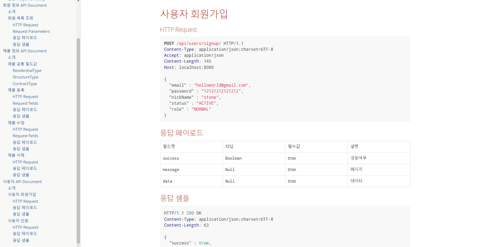
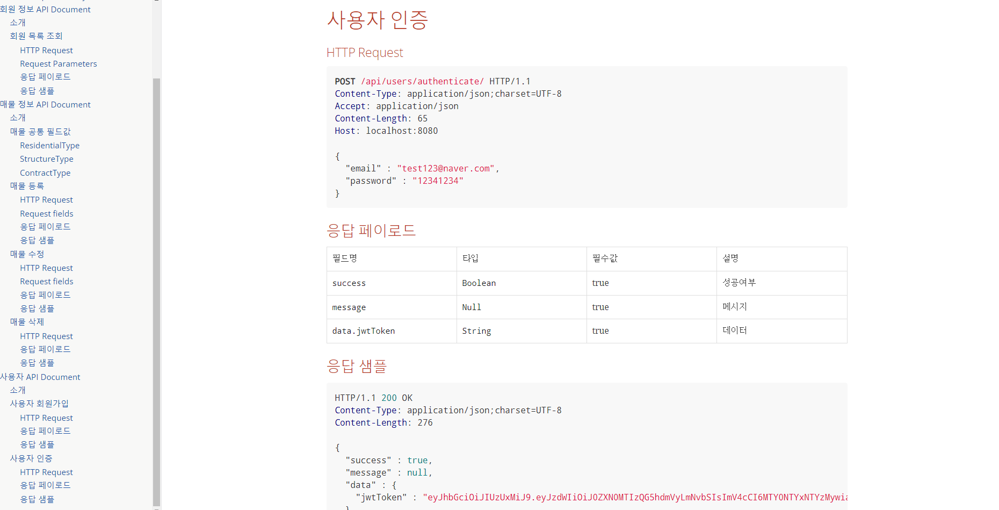
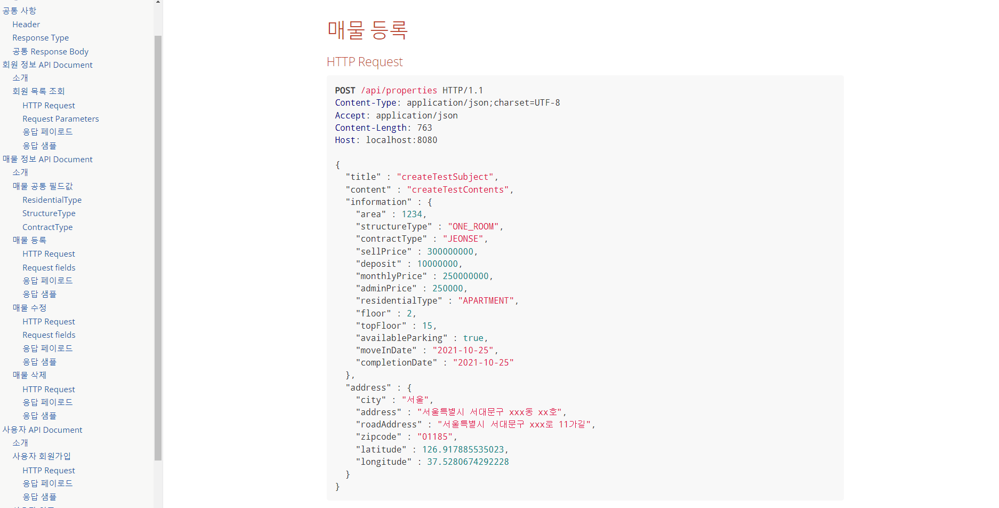
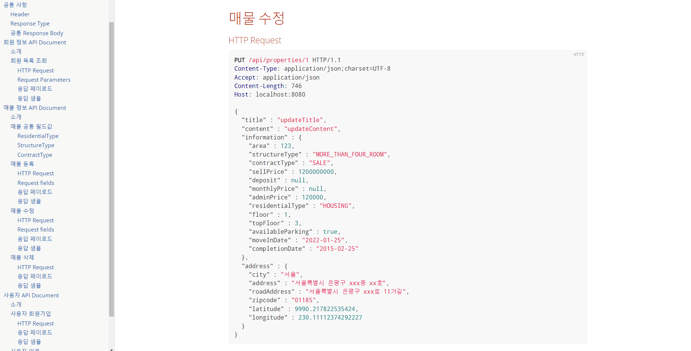
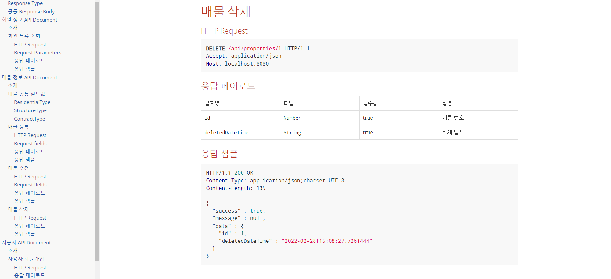
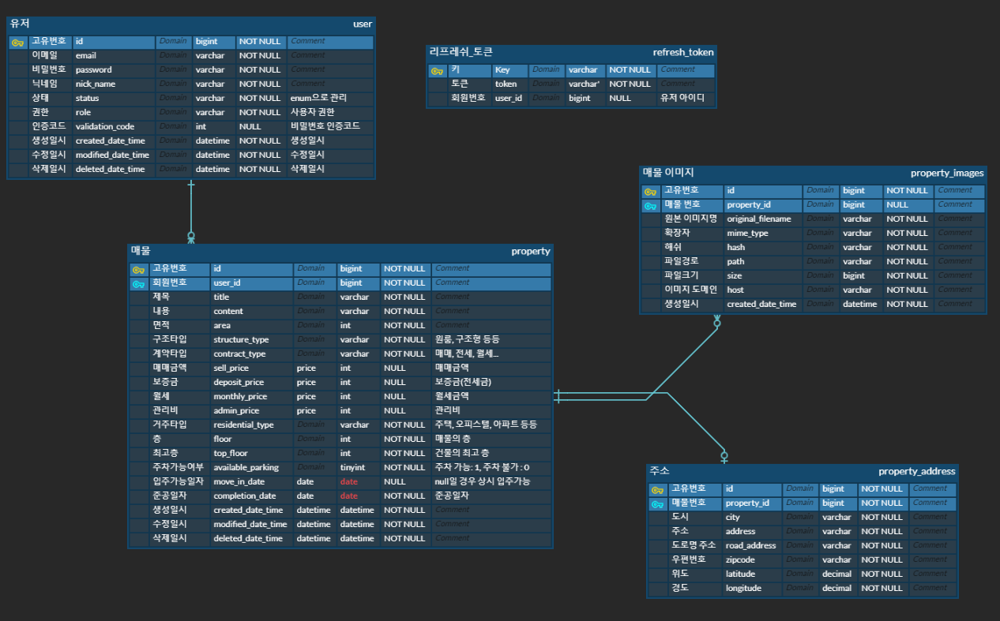

# buridge (부동산 중개 프로젝트)

## 🤔 개요

* 부동산 매수자와 매도자를 이어주는 중계자 역할을 하는 웹 페이지. 아파트, 오피스텔, 토지, 원룸, 재건축, 분양권, 
  민간임대 등 다양한 형태의 부동산 매물을 취급하는 사이트. 
* 다리(bridge)에서 가져와 매수자와 매도자를 잇는 다리역할로서 부동산 다리역할을 하는 의미에서 **Buridge**로 생각.

## 🛠 사용 기술

기술|스펙
---|---|
Language| java 11
Framework|Spring Boot
ORM|JPA, QueryDsl
Build Tool|Gradle
API 문서|Spring RestDocs
TEST|Junit5, Mockito, H2 db
Database|Mysql
Infra|AWS EC2, RDS, S3
정적 분석 도구|CheckStyle
보안|Spring Security, JWT
버전 관리|Git
협업 도구|Slack, JIRA, Confluence

## 📅 개발 기간

* 2022년 1월 30일 ~ ing(진행중)

## 🎯 개발 목표

* 사용자 기반의 편리하고 실용적인 부동산 중개 사이트를 만들고자 합니다.
* 해당 프로젝트를 통해 테스트 코드와 객체지향 프로그래밍에 조금더 익숙해지기 위해 만든 사이드 프로젝트입니다.

## 📜 API 명세

* 회원가입

* 사용자 인증

* 매물 등록

* 매물 수정

* 매물 삭제

## 💾 ERD

